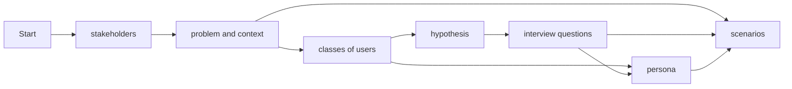

# User Research

Document your user research (plan and findings).

## Mkdocs snippets
- unordered list with - and four spaces for sub list
- ordered list with 1.
- links with [mkdocs-material](https://squidfunk.github.io/mkdocs-material/reference/)
- references defined in docs/lit.bib may be referenced with [@hciscript]
- reference a chapter of your docs [demo](./3-Design.md#demo)
- code snippets

```dart
Future<void> printOrderMessage() async {
  print('Awaiting user order...');
  var order = await fetchUserOrder();
  print('Your order is: $order');
}
```

- You may include images like this


{: height="5em" width="5em"}


	
<figure markdown="span">
  {width=200}
  <figcaption>
    <a href="https://www.nngroup.com/articles/ux-research-cheat-sheet/">UX Research Cheat Sheet</a>: UX Methods
  </figcaption>
</figure>

- admonitions

!!! note
	this is a note
	
!!! abstract "title"
	this is an admonition with title
	
!!! info ""
	an info without title
	
!!! tip
	a tip

!!! example
	an example


!!! warning
	a warning
	
!!! cite
	"this is a cite"[@hciscript]

- [mermaid graphics](https://mermaid.js.org/intro/)



- [emojis](https://squidfunk.github.io/mkdocs-material/reference/icons-emojis/)
	- :smile:
	- :video_camera:
	- :fontawesome-solid-user: