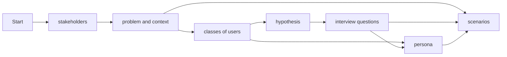

# User Research

Document your user research (plan and findings).

## Mkdocs snippets
- unordered list with - and four spaces for sub list
- ordered list with 1.
- links with [mkdocs-material](https://squidfunk.github.io/mkdocs-material/reference/)
- references defined in docs/lit.bib may be referenced with [@hciscript]
- reference a chapter of your docs [demo](./3-Design.md#demo)
- code snippets

```dart
Future<void> printOrderMessage() async {
  print('Awaiting user order...');
  var order = await fetchUserOrder();
  print('Your order is: $order');
}
```

- You may include images like this


{: height="5em" width="5em"}


	
<figure markdown="span">
  {width=200}
  <figcaption>
    <a href="https://www.nngroup.com/articles/ux-research-cheat-sheet/">UX Research Cheat Sheet</a>: UX Methods
  </figcaption>
</figure>

- admonitions

!!! note
	this is a note
	
!!! abstract "title"
	this is an admonition with title
	
!!! info ""
	an info without title
	
!!! tip
	a tip

!!! example
	an example


!!! warning
	a warning
	
!!! cite
	"this is a cite"[@hciscript]

- [mermaid graphics](https://mermaid.js.org/intro/)



- [emojis](https://squidfunk.github.io/mkdocs-material/reference/icons-emojis/)
	- :smile:
	- :video_camera:
	- :fontawesome-solid-user:

# Preparation Lab2 User Research

## Criteria/assumptions of your users
- contious of budget
- interested in new locations
- user may work as a tour guide
- interested in planning own trips
- user may be a shy person
- user maybe wants to travel with people in the same age groupe
- travel groupe wants to share pictures of the trip
- tour organizer wants to provide travel details
- a group of friends want to plan a trip
- family wants to plan a trip
- user wants to do a day trip
- group of friend wants to do a weekend trip
- family is planning a vacation
- user in interested in cultural trips
- user wants to do a relaxing vacation
- user wants to have as much fun as possible
- additional users may want to join during the trip
- user currently has no internet connection
- user wants to plan trips during different seasons
- users eyesight may be worse than yours
- disabilities

## hypotheses
- Reseach Question: What are the benefits of planning a trip with a mobile app?
  - Hypotheses: A likely advantage of planning trips with a mobie app will be the ease of sharing the planned trips with third paries.
- Research Question: What length of trips are users more likely to choose?
  - Hypotheses: A user is more likely to plan a one day trip instead of a whole vacation.
- Reseach Question: Do online vacation planning tools improve the quality of your vacation?
  - Hypotheses: The use of different tools, like Whatsapp for communication, or Dropbox for file sharing can significantly improve the quality of trips in general.

## questions for the interview

### Interview introduction:
1. Verify if its a person of interest
2. Introduction
3. Goal of interview: Gather different perspective and needs

### Questions:
1. How do you currently plan your trips?
2. What do you spend most of your time on planning a trip?
3. What problems do you run into planning a trip?

4. For what kind of goups do you plan you trips?
5. Top 3 worst things planning a trip?
6. What makes a good trip, what makes a bad one?

7. What modes of transportation do you use during your trips?
8. How many pictures/videos etc. do you share per trip?
9. If you had a wish?

### End of Interview:
1. Thank person


# NZSE User Research
[Based on Prof. Dr. Stefan Zander](https://www.youtube.com/watch?v=qA0DlfghMAY&t=1s)
## 1. User list
- Jakob
- Julian
- Morten
- Mats

## 2. Criteria list
- Age 
- Wealth
- adventurousness
- leisure time
- languages
- travel experience
- planning experience
- smartphone/pc experience
- education

### 2.1 Operationalization
We have decided to quantify the criteria on a scale from 0 to 10 so that it is easier to compare the values later on
- e.g. Age: ~20=3 ~40=5 ~80=10
- e.g. languages: native language + basic second language = 3. 3 languages = 6. 5+ languages = 10
- etc. 

## 3. Create Matrix 
|             | Age | Wealth | adven\-turous\-ness | leisure time|languages|travel experience|planning experience|technical experience| education|
|-------------|--|--|--|--|--|--|--|--|--|
| Jakob       |3 |3 |4 |6 |3 |7 |5 |7 |6 |
| Julian      |3 |5 |2 |6 |3 |4 |4 |7 |6 |
| Morten      |3 |2 |4 |8 |4 |5 |6 |8 |7 |
| Mats        |3 |1 |6 |8 |4 |7 |6 |7 |7 |
| NAME        | | | | | | | | | |
| NAME        | | | | | | | | | |
| NAME        | | | | | | | | | |
| NAME        | | | | | | | | | |
| NAME        | | | | | | | | | |
| NAME        | | | | | | | | | |
| NAME        | | | | | | | | | |
| NAME        | | | | | | | | | |
| NAME        | | | | | | | | | |
| NAME        | | | | | | | | | |
| NAME        | | | | | | | | | |
| NAME        | | | | | | | | | |
| NAME        | | | | | | | | | |
| NAME        | | | | | | | | | |
| NAME        | | | | | | | | | |
| NAME        | | | | | | | | | |
| NAME        | | | | | | | | | |
| NAME        | | | | | | | | | |
| NAME        | | | | | | | | | |
| NAME        | | | | | | | | | |
| NAME        | | | | | | | | | |
| NAME        | | | | | | | | | |
| NAME        | | | | | | | | | |
| NAME        | | | | | | | | | |
| NAME        | | | | | | | | | |
| NAME        | | | | | | | | | |

## 4. N-Dimentional Vector Space
For a three dimentional vector space we choose the criterias: **age**, **adventurousness** and **travel experience**

*Hier wird dann das Koordinatensystem eingefügt*

## 4.1 Persona
We choose the most extreme User for each criteria, as highlighted in the image above. Now we will create a Persona describtion for every persona.


# Partially standardized interviews
# Requirement scenarios