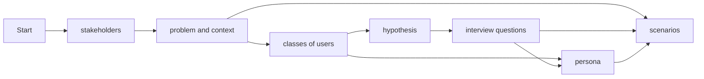

# User Research

Document your user research (plan and findings).

## Mkdocs snippets
- unordered list with - and four spaces for sub list
- ordered list with 1.
- links with [mkdocs-material](https://squidfunk.github.io/mkdocs-material/reference/)
- references defined in docs/lit.bib may be referenced with [@hciscript]
- reference a chapter of your docs [demo](./3-Design.md#demo)
- code snippets

```dart
Future<void> printOrderMessage() async {
  print('Awaiting user order...');
  var order = await fetchUserOrder();
  print('Your order is: $order');
}
```

- You may include images like this


{: height="5em" width="5em"}


	
<figure markdown="span">
  {width=200}
  <figcaption>
    <a href="https://www.nngroup.com/articles/ux-research-cheat-sheet/">UX Research Cheat Sheet</a>: UX Methods
  </figcaption>
</figure>

- admonitions

!!! note
	this is a note
	
!!! abstract "title"
	this is an admonition with title
	
!!! info ""
	an info without title
	
!!! tip
	a tip

!!! example
	an example


!!! warning
	a warning
	
!!! cite
	"this is a cite"[@hciscript]

- [mermaid graphics](https://mermaid.js.org/intro/)



- [emojis](https://squidfunk.github.io/mkdocs-material/reference/icons-emojis/)
	- :smile:
	- :video_camera:
	- :fontawesome-solid-user:

# Preparation Lab2 User Research
See [here] (./2-UserResearch.md#Partially standardized interviews) for the Partially standardized interview.

## Criteria/Assumptions of your users
- Interested in new locations
- Interested in planning own trips
- A group of friends wants to plan a trip
- User may be a shy person
- User may want to travel with people in the same age group
- Travel group wants to share pictures of the trip
- User may work as a tour guide
- Tour organizer wants to provide travel details
- Family wants to plan a trip/vacation
- User wants to do a day trip
- Group of friends wants to do a weekend trip
- User is interested in cultural trips
- User wants to do a relaxing vacation
- User wants to have as much fun as possible
- Additional users may want to join existing trips
- User currently has no internet connection
- User wants to plan trips during different seasons
- Conscious of budget
- User's eyesight may be worse than yours
- Disabilities


## Hypotheses
- Research Question: What are the benefits of planning a trip with a mobile app?
  - Hypotheses: A likely advantage of planning trips with a mobile app will be the ease of sharing the planned trips with third parties.
- Research Question: What lengths of trips are users more likely to choose?
  - Hypotheses: Users are more likely to plan a one-day trip instead of a longer vacation.
- Research Question: Do online vacation planning tools improve the quality of vacations?
  - Hypotheses: The use of different tools, like WhatsApp for communication, or Dropbox for file sharing, can significantly enhance the quality of trips in general.

## Questions for the interview

### Interview introduction:
1. Verify if they are a person of interest
2. Introduction
3. Goal of the interview: Gather different perspectives and needs

### Questions:
1. How do you currently plan your trips?
2. What do you spend most of your time on when planning a trip?
3. What problems do you encounter when planning a trip?

4. For what kinds of groups do you plan your trips?
5. What are the top 3 worst things when planning a trip?
6. What factors do you believe make a trip good or bad?

7. What modes of transportation do you use during your trips?
8. How many pictures/videos etc. do you share per trip?
9. If you had a wish?

### End of Interview:
1. Thank the person


# NZSE User Research
[Based on Prof. Dr. Stefan Zander](https://www.youtube.com/watch?v=qA0DlfghMAY&t=1s)
## 1. User list
- Jakob
- Julian
- Morten
- Mats
- (See the table below for more)

## 2. Criteria list
- Age 
- Wealth
- Adventurousness
- Free time
- Languages
- Travel experience
- Planning experience
- Smartphone/pc experience
- Education

### 2.1 Operationalization
We have decided to quantify the criteria on a scale from 0 to 10 so that it is easier to compare the values later on
- e.g. Age: ~20=3 ~40=5 ~80=10
- e.g. languages: native language + basic second language = 3. 3 languages = 6. 5+ languages = 10
- etc. 

## 3. Create Matrix 
|             | Age | Wealth | Adven\-turous\-ness | Free time|Languages|Travel experience|Planning experience|Technical experience| Education|
|-------------|--|--|--|--|--|--|--|--|--|
| Jakob       |3 |3 |4 |6 |3 |7 |5 |7 |6 |
| Julian      |3 |5 |2 |6 |3 |4 |4 |7 |6 |
| Morten      |3 |2 |4 |8 |4 |5 |6 |8 |7 |
| Mats        |3 |1 |6 |8 |4 |7 |6 |7 |7 |
| Marc        |3 |3 |2 |2 |5 |6 |6 |6 |7 |
| Leo         |4 |5 |7 |5 |3 |6 |6 |8 |9 |
| Janosch     |4 |5 |7 |3 |6 |7 |7 |9 |9 |
| NAME        | | | | | | | | | |
| NAME        | | | | | | | | | |
| NAME        | | | | | | | | | |
| NAME        | | | | | | | | | |
| NAME        | | | | | | | | | |
| NAME        | | | | | | | | | |
| NAME        | | | | | | | | | |
| NAME        | | | | | | | | | |
| NAME        | | | | | | | | | |
| NAME        | | | | | | | | | |
| NAME        | | | | | | | | | |
| NAME        | | | | | | | | | |
| NAME        | | | | | | | | | |
| NAME        | | | | | | | | | |
| NAME        | | | | | | | | | |
| NAME        | | | | | | | | | |
| NAME        | | | | | | | | | |
| NAME        | | | | | | | | | |
| NAME        | | | | | | | | | |
| NAME        | | | | | | | | | |
| NAME        | | | | | | | | | |
| NAME        | | | | | | | | | |
| NAME        | | | | | | | | | |

## 4. N-Dimentional Vector Space
For a three dimentional vector space we choose the criterias: **age**, **adventurousness** and **travel experience**

*Hier wird dann das Koordinatensystem eingefügt*

## 4.1 Persona
We choose the most extreme User for each criteria, as highlighted in the image above. Now we will create a Persona description for every persona.


# Partially standardized interviews

### Interview introduction:
1. Verify if they are a person of interest
2. Introduction
3. Goal of the interview: Gather different perspectives and needs

### Questions:
**Personal Question**:
- Name
- Age
- Latest travel destination
- Travel frequency
- Preference for forest or sea

**Funnel Questions**:

Wide questions:

1. How do you currently plan your trips?
2. What do you spend most of your time on when planning a trip?
3. What problems do you encounter when planning a trip?
4. What are the important aspects of a trip planning app?

Semi-wide questions:

1. For what kinds of groups do you plan your trips?
2. What are the top 3 worst things when planning a trip?
3. What factors do you believe make a trip good or bad?
4. What are important subjects while travelling?
5. What communication methods do you typically use while traveling?

Tight questions:

1. What modes of transportation do you use during your trips?
2. How many pictures/videos etc. do you share per trip?
3. What type of vacation do you most frequently take?
4. Have you traveled outside of Europe already?
5. Rank the following aspects: people, activities, hotel/resting place
6. Ranking of features:
  - Financial management
  - Travel souvenirs (picutres/videos)
  - Checklists
  - Weather for travel time period
  - Chat
  - Voting
  - Travel documents organization
  - Flight/transportation details
  - Map with planned activies
  - Plan activities for the day/whole trip

**ending question**:

1. If you had a wish?

### End of Interview:
1. Thank the person.

# Requirement scenarios

# User Scenarios
!!! abstract "Discover activities, meet new people"
	Steve wants to go on vacation, but his friends are unavailable. He's keen on visiting Barcelona but isn't enthusiastic about traveling alone. So, he picks up his phone and searches for public group trips to Barcelona using an app. He explores the app for activities in Barcelona, and potential travel companions, communicating with them via chat in the app.

!!! abstract "Plan and organize a trip"
	Steffi and her friends are planning a vacation but haven't decided on a destination yet. They search for fun activities in various travel destinations. After deliberation, they settle on London and create a private trip within the app. To ensure a smooth trip, they meticulously plan every aspect through the app, including selecting activities, organizing expenses, and creating checklists. Each friend actively participates in the trip planning process via the app. During their vacation, they use the app to collectively store pictures taken in London as shared memories.

!!! abstract "Publish activities and conduct tours"
	Rudi, an experienced tour guide familiar with local activities and attractions in London, shares his knowledge by posting these activities within the app. On Saturdays, he conducts guided tours of London. To organize these tours efficiently, he creates private trips within the app and invites the participants. Using the app, he facilitates communication and decision-making among participants, also providing a platform for sharing information and photos taken during the tour.

# Vision Statement
For **group travelers**, <br>
Who are **overwhelmed** by trip planning complexities <br>
Our travel-app is a **comprehensive travel organization tool** <br>
That makes planning a group trip **easier** and **faster**. <br>
Setting us apart from widespread apps like Expedia with integrated **collaboration** features, <br>
Bringing ease and unity to every adventure.

# Interviews

## Katarina (20)

**Personal Questions**
- Latest Travel: Japan
- Frequency: Frequent
- Prefecence F/S: Sea

**Funnel Questions**
- Plan Trips (currnt): Searching for destinations Online, looking for weather, searching for interesting activities, looking at travel blocs/ Social Media. Bookinf throug specialised websites
- Comparaison of different offers such as flights/accomodation and lookinf for recomodations. 
- Problems encountered: Finding affordable offeres, coordination with friends and Familiy, time managment.
- Important aspects: Easy to use interface, social features, ffedback for POI'S
______________________________
- Small groups like friends/ family not moe that 5
- Top 3 Worst things:
  - Keeping an overview of the neccessary documents
  - Coordinating the schedule
  - Finding the affordable flight
- What makes/ breakes a Trip: Good weather, nice activities, beatifull accomodations,if those are not given it breaks the trip.
- Important Subjekts: Safety, Monatary Managment, Keeping track of travel dokuments, communication within the Travel Group. 
- Communication Methodes used: WhatsApp, Discord

___________________________
- Modes of transportation: To arrive at destination: car/train/plane. In Situ PT or rental Car

- Quantity of Pictures: ~250 - 500
- What type of vacation: Beach Vacations
- Travel outside of EU: NO
- Ranking of aspekts: People, Activities, Hotel/Resting
- Ranking of Features:
  - Map with planned activities
  - Plan activities for the day/whole trip
  - Weather for travel time period
  - Flight/transportation details
  - Checklists
  - Travel documents organization
  - Financial management
  - Travel souvenirs (pictures/videos)
  - Voting
  - Chat

## Andreas (48)

**Personal Questions**
- Latest Travel: Austria
- Frequency: Semi-Frequent
- Prefecence F/S: Forest

**Funnel Questions**
- Plan Trips (currnt): Looking for Hiking-Trails, Interesting location for the entier Family
- Researching, Comparing Accomodation because of DOG. 
- Problems encountered: Finding an accomodation that accepts Pets, Transportation
- Important aspects: Find a Pet frendly accomodation, detailed activities on Family- Friendly Activities, weather forcasts.
______________________________
- Family (6 (2 Dogs)).
- Top 3 Worst things:
  - Finding no Pet Friendly Accomodations
  - Not beeing able to balance INterests and Schedules of Family memberes
  - Forgetting something inportant at home
- What makes/ breakes a Trip: Enjoable Activities for everybody, good food and weather, bad trips do not meet these criteria.
- Important Subjekts: Family Comfort, Ensuring everyones Joy, keeping track of the money 
- Communication Methodes used: Peronal Communication, WhatsApp, SMS

___________________________
- Modes of transportation: Plane, Car

- Quantity of Pictures: ~20 - 50
- What type of vacation: Adventure and Relaxation
- Travel outside of EU: YES (NA, OC)
- Ranking of aspekts: People, Activities, Hotel/Resting
- Ranking of Features:
  - Checklist
  - Financial management
  - Plan activities for the day/whole trip
  - Travel documents organization
  - Weather for travel time period
  - Flight/transportation details
  - Map with planned activities
  - Travel souvenirs (pictures/videos)
  - Voting
  - Chat