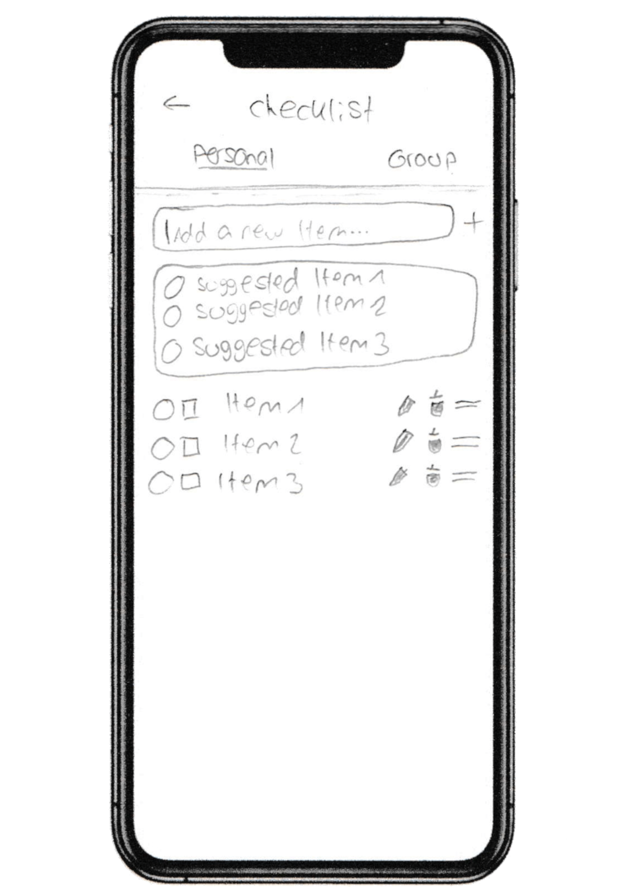

# Design

This page outlines the design process for our app, detailing the steps we took from initial paper prototypes to the final Figma design.

## Paper Prototypes

As an initial step in our design process, we developed two paper prototypes for our app. These prototypes were created to explore different layout options and user interactions. The simplicity of paper prototypes allowed us to quickly iterate on our ideas and gather initial feedback. 

### Explore Activities
{: width="490em"}
{: width="140em"}

### My Trips
{: width="480em"}
### Explore public Trips
{: width="200em"}
### Plan Trips
{: width="380em"}
### Checklist Screen
{: width="200em"}
### Account Screen
{: width="200em"}

After the discussion and feedback session, we realized that our prototypes needed adjustments to better implement the functionality we envisioned. We selected the screens which we deemed best and discussed changes such as adding headers and labels, replacing certain elements, and rearranging the layout. Additionally, we talked about new screens, useful features like filters, new categories, and markers on the map to enhance usability and functionality.

## From Paper Prototypes to Final Figma Design and App Implementation

We incorporated the feedback into our Figma design. This is the result:

The process from initial paper prototypes to the final Figma design was crucial in developing a well-thought-out and user-friendly interface for our app. By iterating on our designs and incorporating feedback at each stage, we ensured that our final design was both functional and aesthetically pleasing. This design process has laid a solid foundation for the implementation phase, where we will bring our Figma prototype to life using Flutter.

The paper prototype shows the rough overall structure of the app. It is the first idea of the app. The Figma design is way more detailed. In the development process we also changed minor details of the idea and design. The app design and functionality involved over time. You can see changes comparing the paper prototype to the figma design, as well as when comparing the figma design to the implementation (In some parts the implementation depended on practicability).
For example:

### Explore Trips Screen
- Introduced a title for the explore Trips screen in the figma prototype.
- Introduced a filter by dates in the explore trips screen.
- Changed the app behavior. The idea of the paper prototype was, that for a displayed trip the images are swipeable (right/left) and to other trips (top/down). This turned to be not ideal when a trip is just created and has no pictures stored. In the figma prototype and implementation the right/left swipe will show other trips (card design) and a image of the destination will be shown instead. [Explore Trips Figma](design/user-pages.md#discover-public-trips).

### Account Screen
- Removed a view options, such as security and notifications. As they are not needed at the moment.
- Introduced public profile.
- Introduced edit options and qr-code option.

### Checklist
Almost the same, just minor details: The icon to create a new item changed from plus to a tick. The group page was also added within the figma design, and more detailed designs.

### Plan Trips, Chat and Gallery
The overall structure stayed nearly the same, only details changed.

### My Trips
- The current trip changed to a big picture.
- The upcomming and previous trips changed to cards with small overlapping picture.

### Explore Activities
- Added the explore all to be a city-search with categories.
- More details like adding activities to trips were introduced.
