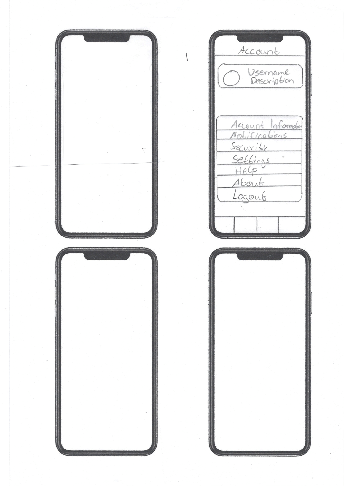

# Design

This page outlines the design process for our app, detailing the steps we took from initial paper prototypes to the final Figma design.

## Paper Prototypes

As an initial step in our design process, we developed two paper prototypes for our app. These prototypes were created to explore different layout options and user interactions. The simplicity of paper prototypes allowed us to quickly iterate on our ideas and gather initial feedback. 

    

        
    

    

        
    

    

        
    

    

        
    

    

        
    

After the discussion and feedback session, we realized that our prototypes needed adjustments to better implement the functionality we envisioned. We selected the screens which we deemed best and discussed changes such as adding headers and labels, replacing certain elements, and rearranging the layout. Additionally, we talked about new useful features like filters, new categories, and markers on the map to enhance usability and functionality.

## From Paper Prototypes to Final Figma Design

We incorporated the feedback into our Figma design. This is the result:

The process from initial paper prototypes to the final Figma design was crucial in developing a well-thought-out and user-friendly interface for our app. By iterating on our designs and incorporating feedback at each stage, we ensured that our final design was both functional and aesthetically pleasing. This design process has laid a solid foundation for the implementation phase, where we will bring our Figma prototype to life using Flutter.

## User Flow Diagram

Here is the user flow diagram. We have divided it into multiple images for clarity. Each image focuses on a different section of the navigation bar:

## Data Flow Diagram

Here is the data flow diagram:

