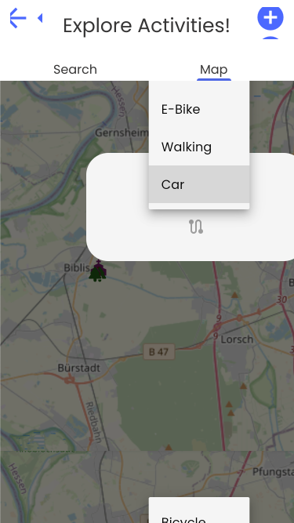

### Explore Activities

This section presents and describes the screens related to exploring activities in detail. Here, you can find the user flow diagram and data flow diagram.

### User Flow Diagram:

## Main Screen
!!! info "Explanation"
    The screen contains a search bar at the top, where users can search for specific activities. The search bar is supported by an API, which suggests and autocompletes activities.

    Below the search bar, there is an option to explore top activities from all continents by pressing the button with the map.

    Under this, you can see randomly recommended activities from one continent and the most popular activities from around the world.

<figure markdown="span">
{: width="250em"}
</figure>

## Explore Activities - Continents
!!! info "Explanation"
    You arrive at this page by clicking the map button on the previous screen. Here, you can select one of the six continents to view a list of activities available there.

    On the screen where activities are listed, there is a search bar to look for specific activities on that continent.

    Additionally, on the third screen, you have the option to filter by a specific country or category of activity, which will then be applied on the list.

<figure markdown="span">

</figure>

## Explore Activities - City
!!! info "Explanation"
    If you go to the "Explore All" tab on the main screen, you will be taken to the search screen. Here, you can search for specific activities in a city and select particular categories.

    You will then be taken to a screen where the list of activities is displayed. These activities are fetched from an API. Additionally, activities added by users that match the search criteria will also be displayed.

<figure markdown="span">
{: width="550em"}
</figure>

## Details Screen
!!! info "Explanation"
    You reach this screen by clicking on an activity on any of the previous screens. This page contains information about the activity, such as its name, description, location, and categories. Additionally, you have the option to add the activity to a trip.

<figure markdown="span">
{: width="250em"}
</figure>

## Add Activity Screen
!!! info "Explanation"
    By clicking the plus icon on the screen where the list of activities is displayed, users can add their own activity. They need to provide the name, description, image, location, and categories for the activity. This activity will then be displayed in the list of activities.

<figure markdown="span">
{: width="550em"}
</figure>

## Map Screen
!!! info "Explanation"
    By going to the "Map" tab, you are taken to this map screen. This screen displays the activities shown in the list. Additionally, it provides route-finding options to the selected activity.

<figure markdown="span">
{: width="550em"}

</figure>
!!! info "Explanation"
    The App offers the possibility to calculate a Route with different mobilities. If a different mobility has been chosen the displayed Route will try to calculate the Optimal Route for that chosen mobility.

<figure markdown="span">
{: width="250em"}

##
### Data Flow Diagram

Here you can see the data flow diagram, which shows how data flows through the application.

The main screen and the screens on the lower part of the diagram use locally stored data to display the activities and continents with the necessary information. 
The activities list may be filtered by country and categories if filters are applied.

The upper screens and the search bars use an API ([geoapify](https://www.geoapify.com/)). The search bars receive autocomplete and suggestions from the API.

The top screen with the activities list primarily fetches its activities from the API, loading activities that match the provided city and categories. Additionally, activities added by users are also loaded from firebase.

All activity images (except those added by users) are fetched from another API.

When a user adds an activity, it is stored in Firebase.

### Data Flow Diagram for the Map

The Data Flow Section for the map represents but a small subsection of the Data Flow Section of the entirety of the Map. 

In this diagram we can see that the main point of Data Transition between the Map Portion of the App and the Rest of the App is through the API which gives access to the different Activities. Those activities then lead to the creation of the Marker Points on the Map. 

The same Data is then being used to calculate the route if the User so chooses. The Route then takes the Position of the User and the information of the activities to calculate and display the route.

