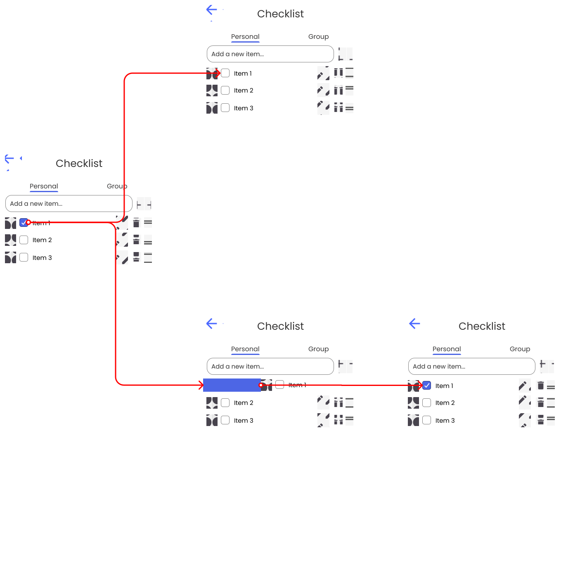
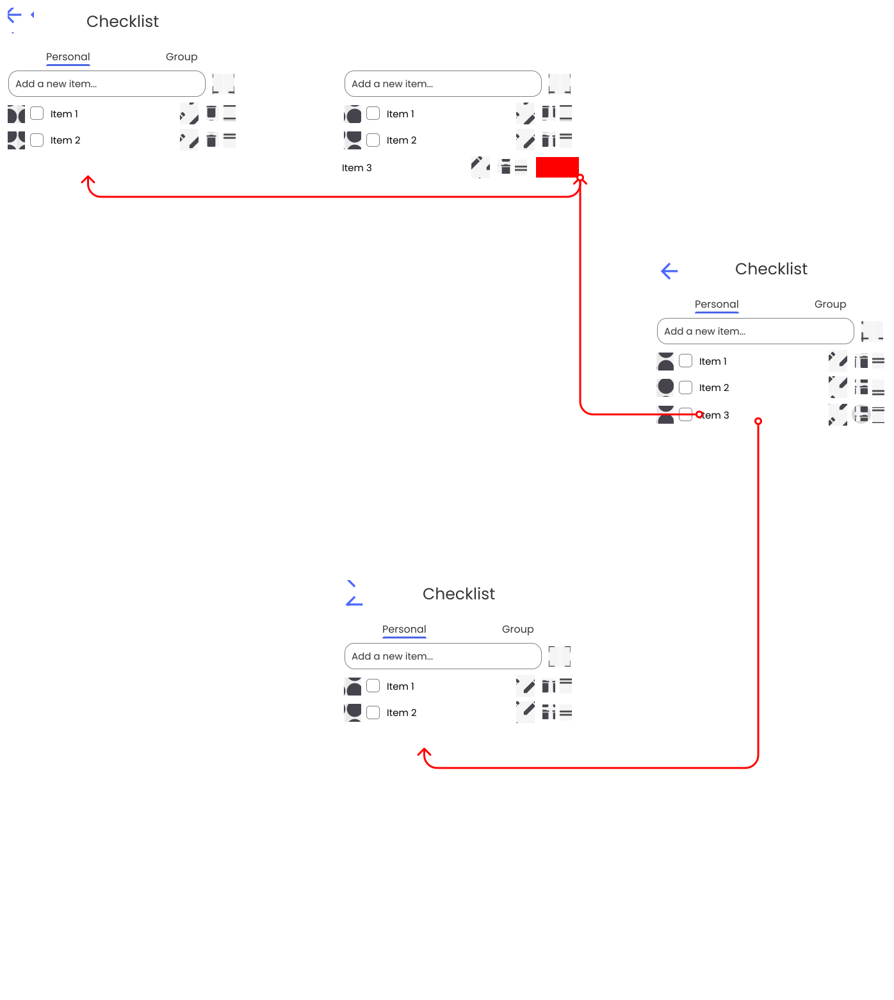
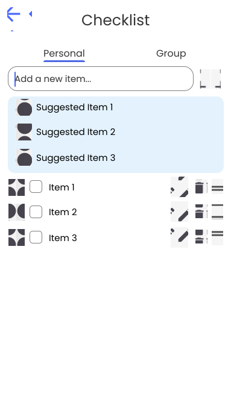
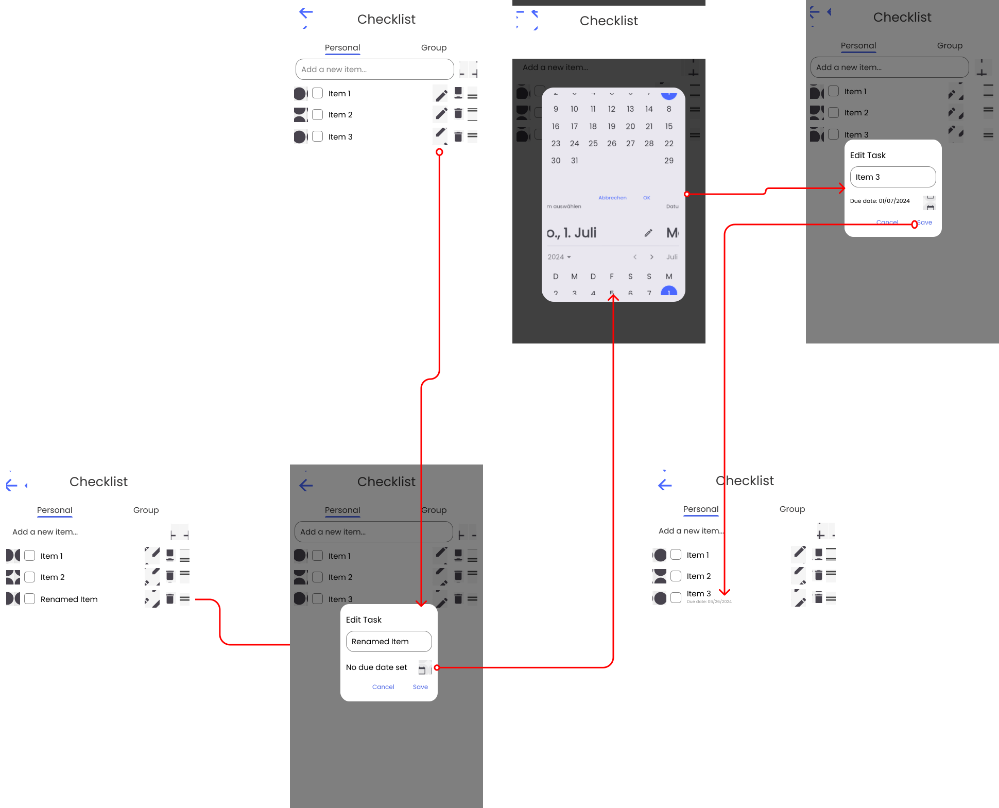
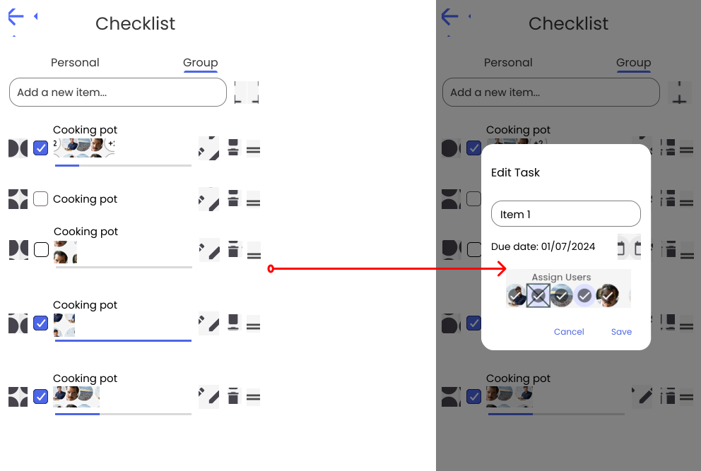
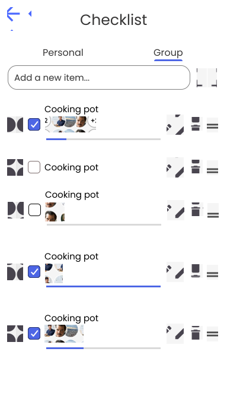

## Trip Overview
!!! info "Explanation"
	The trip overview page in the app provides a comprehensive view of all essential details related to a specific trip. It typically includes: name, description, date range, participants preview, activities preview, checklist preview, map preview

<figure markdown="span">
  {: width="300em"}
</figure>

## Trip Participants
!!! info "Explanation"
	The app allows you to easily show all participants and add friends to your trip. You can search for users and inspect their public profile before adding them to the trip.

<figure markdown="span">
  
</figure>

## Trip Chat
!!! info "Explanation"
	Each trip in the app includes a dedicated chatroom where all participants can communicate and coordinate plans. This feature allows group members to easily discuss itineraries, share updates, ask questions, and make decisions collaboratively in real time.

<figure markdown="span">
  {: width="240em"}
</figure>

## Shared Memories
!!! info "Explanation"
	Each trip in the app includes a shared gallery where all participants can upload and view photos and videos from their journey. This feature allows group members to collectively save and cherish memories, creating a visual story of their trip. The shared gallery helps preserve the experiences and highlights of the trip, making it easy for everyone to relive and enjoy those moments.

<figure markdown="span">
  
</figure>

# Checklist
!!! info "Explanation"
    Using a checklist to plan a trip is essential for ensuring that nothing important is overlooked, from packing necessary items to making crucial reservations. It helps in organizing tasks systematically, reducing the stress and last-minute rush often associated with travel preparations. A well-structured checklist provides a clear roadmap, allowing travelers to track progress and ensure that all logistics, such as accommodation, transportation, and activities, are accounted for. It also aids in budgeting, as it can include cost estimates and deadlines for various expenses. Ultimately, a checklist enhances the overall travel experience by promoting thorough preparation and peace of mind.

## Personal Checklist
!!! info "Explanation"
    Creating a personal checklist that is only visible to you allows for complete customization to suit your unique needs and preferences, ensuring every detail is accounted for. It keeps sensitive information secure, such as passport numbers and medical details, safeguarding your privacy. This private checklist also offers flexibility, enabling you to make adjustments as plans evolve without external interference. Additionally, it promotes a sense of accountability, helping you stay organized and proactive in managing your travel preparations.

The Personal Checklist provides the following features: [Toggle item state](#toggle-item-state), [Delete item](#delete-item), [Custom items](#custom-items), [Item suggestion](#item-suggestion), [Due date](#due-date), [Edit title](#edit-task).

## Group Checklist
!!! info "Explanation"
    A shared group checklist is essential for coordinating and organizing tasks among multiple travelers, ensuring everyone is on the same page. It promotes clear communication, allowing each member to see and understand their responsibilities and the overall progress of trip preparations. By distributing tasks, a group checklist reduces the workload on any single person, making the planning process more efficient and less stressful. It also helps avoid duplication of efforts, as everyone can see what has already been completed. Ultimately, a shared checklist fosters teamwork and ensures a smoother, more collaborative travel experience.

The Group Checklist provides the following features: [Toggle item state](#toggle-item-state), [Delete item](#delete-item), [Custom items](#custom-items), [Item suggestion](#item-suggestion), [Due date](#due-date), [Edit title](#edit-task), [Assign users](#assign-users), [Progress bar](#progress-bar).

## Features of the Checklist

### Toggle item state
This feature allows users to mark items as complete or incomplete with a simple toggle. It is necessary for tracking progress and ensuring tasks are visibly completed. 

The user has two different methods to toggle the item state:

1. By clicking on the checkbox
2. Swiping the item from left to right also toggles the checkbox state

<figure markdown="span">
  
</figure>

### Delete item
Users can remove items from the checklist when they are no longer relevant. This helps maintain an up-to-date and clutter-free list.

The user has two different methods to delete an item:

1. By clicking on the bin icon
2. Swiping the item from right to left 

<figure markdown="span">
  
</figure>

### Custom items
This feature enables users to add personalized tasks to the checklist. It is essential for tailoring the list to specific needs and preferences.

The User can type text to and add it as a checklist item.

<figure markdown="span">
  
</figure>

### Item suggestion
The system suggests items based on  a predefined templates. This helps users remember common tasks and improves efficiency by reducing manual input.

<figure markdown="span">
  
</figure>

### Due date
Users can assign due dates to individual tasks. This is crucial for managing deadlines and prioritizing tasks based on urgency.

<figure markdown="span">
  
</figure>

### Edit title
This feature allows users to modify the title of tasks. It is necessary for correcting errors and refining task descriptions to ensure clarity.

<figure markdown="span">
  
</figure>

### Assign users
Users can delegate tasks to specific individuals within the checklist. This is important for collaboration and accountability in team settings.

<figure markdown="span">
  
</figure>

### Progress bar
A visual representation of completed versus pending tasks. It provides a quick overview of progress and motivates users to complete all items on the list.

<figure markdown="span">
  
</figure>