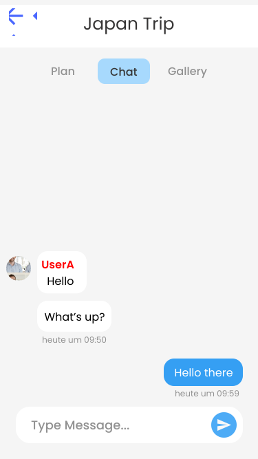

## Trip Overview
!!! info "Explanation"
	The trip overview page in the app provides a comprehensive view of all essential details related to a specific trip. It typically includes: name, description, date range, participants preview, activities preview, checklist preview, map preview

<figure markdown="span">
  {: width="300em"}
</figure>

## Trip Participants
!!! info "Explanation"
	The app allows you to easily show all participants and add friends to your trip. You can search for users and inspect their public profile before adding them to the trip.

<figure markdown="span">
  
</figure>

## Trip Chat
!!! info "Explanation"
	Each trip in the app includes a dedicated chatroom where all participants can communicate and coordinate plans. This feature allows group members to easily discuss itineraries, share updates, ask questions, and make decisions collaboratively in real time.

<figure markdown="span">
  {: width="240em"}
</figure>

## Shared Memories
!!! info "Explanation"
    Each trip in the app includes a shared gallery where all participants can upload and view photos and videos from their journey. This feature allows group members to collectively save and cherish memories, creating a visual story of their trip. The shared gallery helps preserve the experiences and highlights of the trip, making it easy for everyone to relive and enjoy those moments.

<figure markdown="span">
  
</figure>

## Checklist
A checklist is essential for planning a trip to ensure a smooth and stress-free experience. It helps organize all necessary tasks, from booking transportation and accommodation to packing essentials. By itemizing everything, you reduce the risk of forgetting important items or details, which can cause delays or inconveniences. A checklist also helps manage time efficiently, allowing you to prioritize tasks and complete them in a logical order. Moreover, it provides peace of mind, knowing that all aspects of the trip are accounted for, and can be referenced to ensure nothing is overlooked. Ultimately, a checklist enhances preparation, enabling a more enjoyable and worry-free journey.

!!! info "Explanation"
    The Checklist screen is split into a personal- and a group checklist.

## Personal Checklist
!!! info "Explanation"
    A personal checklist is crucial for individual preparation, ensuring that your unique needs and preferences are met. It allows you to tailor items and tasks specifically to your requirements, such as medications, personal care items, and favorite travel gear. This personalized approach helps avoid last-minute stress and ensures you don't overlook essentials that others might not need or consider. Having a personal checklist enhances your comfort and confidence during the trip.

## Group Checklist
!!! info "Explanation"
    A group checklist is vital for coordinating and organizing tasks and items among all members of the travel group. It helps ensure that shared responsibilities, such as booking accommodations, planning activities, and arranging transportation, are clearly outlined and assigned. This collaborative approach prevents duplication of efforts and gaps in preparation, fostering better communication and teamwork. By having a shared checklist, everyone stays informed and accountable, making the trip more efficient and enjoyable for the entire group.

## Basic features

- Toggle checklist item state
- Delete checklist item
- Rename checklist item

### Additional features personal checklist

- word suggestion
- custom checklist items
- only visible to you

## Additional features group checklist

- word suggestion
- custom checklist items
- assigning participants
- progress bar
- see assignees
- see all checklist items, even though you are not assigned

**Toggle checklist item state**: This feature allows users to mark checklist items as complete or incomplete. It helps in tracking progress and ensures that users can easily manage and update their tasks.

**Delete checklist item**: Users can remove unwanted or irrelevant checklist items using this feature. It keeps the checklist organized and free of unnecessary tasks.

**Rename checklist item**: This feature enables users to edit the names of checklist items. It ensures that item descriptions remain clear and accurate as project details evolve.

**Word suggestion**: Provides users with suggested words while creating or editing checklist items. This feature aids in maintaining consistent terminology and helps in quickly formulating task descriptions.

**Custom checklist items**: Allows users to create and add personalized items to the checklist. It ensures that the checklist can be tailored to meet specific needs and requirements.

**Assigning participants**: Users can assign specific tasks to team members. This feature promotes accountability and ensures that everyone knows their responsibilities. As soon as an user got assigned the corresponding task will appear in the users personal checklist as well.

**Progress bar**: Displays a visual representation of the checklist completion status. It provides an at-a-glance summary of overall progress, motivating users to complete their tasks.

**See assignees**: Users can view which participants are responsible for specific tasks. This feature improves transparency and collaboration within the team.

**See all checklist items, even though you are not assigned**: Allows users to view the entire checklist, regardless of their assignments. It ensures that users have a comprehensive overview of the project and can stay informed about all tasks.
