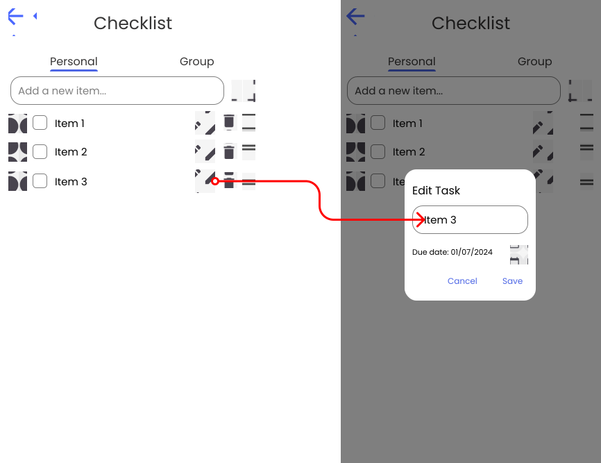

## Trip Overview
!!! info "Explanation"
	The trip overview page in the app provides a comprehensive view of all essential details related to a specific trip. It typically includes: name, description, date range, participants preview, activities preview, checklist preview, map preview

<figure markdown="span">
  {: width="300em"}
</figure>

## Trip Participants
!!! info "Explanation"
	The app allows you to easily show all participants and add friends to your trip. You can search for users and inspect their public profile before adding them to the trip.

<figure markdown="span">
  
</figure>

## Trip Chat
!!! info "Explanation"
	Each trip in the app includes a dedicated chatroom where all participants can communicate and coordinate plans. This feature allows group members to easily discuss itineraries, share updates, ask questions, and make decisions collaboratively in real time.

<figure markdown="span">
  {: width="240em"}
</figure>

## Shared Memories
!!! info "Explanation"
	Each trip in the app includes a shared gallery where all participants can upload and view photos and videos from their journey. This feature allows group members to collectively save and cherish memories, creating a visual story of their trip. The shared gallery helps preserve the experiences and highlights of the trip, making it easy for everyone to relive and enjoy those moments.

<figure markdown="span">
  
</figure>

# Checklist
!!! info "Explanation"
    Using a checklist to plan a trip is essential for ensuring that nothing important is overlooked, from packing necessary items to making crucial reservations. It helps in organizing tasks systematically, reducing the stress and last-minute rush often associated with travel preparations. A well-structured checklist provides a clear roadmap, allowing travelers to track progress and ensure that all logistics, such as accommodation, transportation, and activities, are accounted for. It also aids in budgeting, as it can include cost estimates and deadlines for various expenses. Ultimately, a checklist enhances the overall travel experience by promoting thorough preparation and peace of mind.

## Personal Checklist
!!! info "Explanation"
    Creating a personal checklist that is only visible to you allows for complete customization to suit your unique needs and preferences, ensuring every detail is accounted for. It keeps sensitive information secure, such as passport numbers and medical details, safeguarding your privacy. This private checklist also offers flexibility, enabling you to make adjustments as plans evolve without external interference. Additionally, it promotes a sense of accountability, helping you stay organized and proactive in managing your travel preparations.

The Personal Checklist provides the following features: [Toggle item state](#toggle-item-state), [Delete item](#delete-item), [Custom items](#custom-items), [Item suggestion](#item-suggestion), [Due date](#due-date), [Edit title](#edit-task).

## Group Checklist
!!! info "Explanation"
    A shared group checklist is essential for coordinating and organizing tasks among multiple travelers, ensuring everyone is on the same page. It promotes clear communication, allowing each member to see and understand their responsibilities and the overall progress of trip preparations. By distributing tasks, a group checklist reduces the workload on any single person, making the planning process more efficient and less stressful. It also helps avoid duplication of efforts, as everyone can see what has already been completed. Ultimately, a shared checklist fosters teamwork and ensures a smoother, more collaborative travel experience.

The Group Checklist provides the following features: [Toggle item state](#toggle-item-state), [Delete item](#delete-item), [Custom items](#custom-items), [Item suggestion](#item-suggestion), [Due date](#due-date), [Edit title](#edit-task), [Assign users](#assign-users), [Progress bar](#progress-bar).

## Features of the Checklist

### Toggle item state
This feature allows users to mark items as complete or incomplete with a simple toggle. It is necessary for tracking progress and ensuring tasks are visibly completed. 

The user has two different methods to toggle the item state:

1. By clicking on the checkbox
2. Swiping the item from left to right also toggles the checkbox state

<figure markdown="span">
  
</figure>

### Delete item
Users can remove items from the checklist when they are no longer relevant. This helps maintain an up-to-date and clutter-free list.

The user has two different methods to delete an item:

1. By clicking on the bin icon
2. Swiping the item from right to left 

<figure markdown="span">
  
</figure>

### Custom items
This feature enables users to add personalized tasks to the checklist. It is essential for tailoring the list to specific needs and preferences.

The User can type text to and add it as a checklist item.

<figure markdown="span">
  
</figure>

### Item suggestion
The system suggests items based on  a predefined templates. This helps users remember common tasks and improves efficiency by reducing manual input.

<figure markdown="span">
  
</figure>

### Due date
Users can assign due dates to individual tasks. This is crucial for managing deadlines and prioritizing tasks based on urgency.

<figure markdown="span">
  
</figure>

### Edit title
This feature allows users to modify the title of tasks. It is necessary for correcting errors and refining task descriptions to ensure clarity.

<figure markdown="span">
  
</figure>

### Assign users
Users can delegate tasks to specific individuals within the checklist. This is important for collaboration and accountability in team settings.

<figure markdown="span">
  
</figure>

### Progress bar
A visual representation of completed versus pending tasks. It provides a quick overview of progress and motivates users to complete all items on the list.

<figure markdown="span">
  
</figure>

## Example usage
Right after creating a trip or joining an existing one, you may start to sort your thoughts and have a place to write down all the things you have to prepare for the trip. There might be things you have to worry about multiple months before the trip, like requesting a visa. Some things have to be done some weeks before the trip, like buying a new swimsuit. And some to-dos have to be completed on the day the trip starts, for example, packing your toothbrush into your bag.

Everything can be placed in the checklist for the corresponding trip. Some checklist items are only relevant to you. You can enter things like contact lenses or your favorite book into your personal checklist, only visible to you. Since you may want to read your favorite book before the trip, you can set the due date to the date the trip starts. Other items like the contact lenses can be marked as done right after you put them in your bag. Let's say you finished your book earlier; you have the option to adjust the title of the checklist item to match your new book title. Or let's say you made the decision to take glasses with you instead of contact lenses; you can delete the contact lenses and start typing in the text field, and you should already get a matching suggestion.

If you or other trip participants want to create checklist items that are relevant for all trip participants, they can create them in the group screen. Let's say you and your friends go on a camping trip in the mountains. You probably need just one or two tents, so not everyone has to carry their own while hiking. You can create a custom checklist item and use the edit task option to assign users. You can assign no one if you just want to write it down so it stays in your mind and assign users later, maybe after you discuss in the chat who has a tent and who doesn’t. If you already know that you will be an assignee, you can assign yourself and maybe one more user. The group checklist item will be placed in the group checklist view as well as in your personal checklist view so all to-dos that have to be done by you are in your personal view.

Let's say your mate marks the tent checklist item as done; the progress bar will go to 50 percent to indicate that half of the assignees have already completed this checklist item. If you also mark it as done, the progress bar will rise to 100 percent.

If another user creates a group checklist item and you are not assigned, you can still see this item. This avoids the same item being created by multiple users. But there is a slight difference: you can’t mark the item as done. Only assigned users can toggle the item state.

When you are in the checklist overview screen, you will receive a preview of your personal checklist screen since this one even stores the group checklist items where you have been assigned. This preview of the unchecked items always gives you an idea of what you can do to come a bit closer to a perfectly organized trip.

Lets say your mate makrs the tent checklist item as done ther will go a progress bar to 50 percent to indicate that half of the assignees already compledet this checklist item. If you also mark it as done th progressbar will rise to 100 percent.

If another user creates a group checklist item and you are not assigned. You still can see this item, this avoids that the same item gets created by multiple users. But there is a slightly difference, you cant mark the item as done. Only assigned users can toggle the item state.

When you are in the checklist overview screen you will receive a preview of yor personal checklist screen, since this one even stores the group checklist items where you have been assigned. This preview of thee unckecked items always gives you an idea of what you can do to come a bit closer to a perfect organized trip.