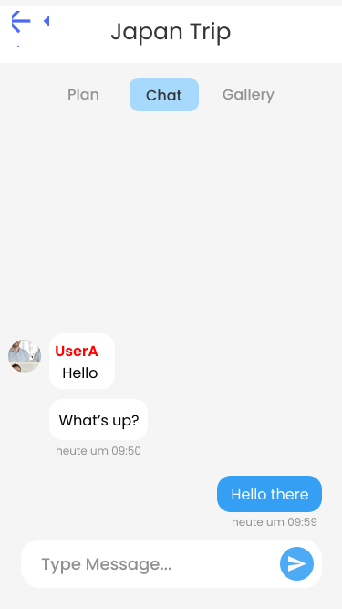

## Trip Overview
!!! info "Explanation"
	The trip overview page in the app provides a comprehensive view of all essential details related to a specific trip. It typically includes: name, description, date range, participants preview, activities preview, checklist preview, map preview

<figure markdown="span">
  {: width="300em"}
</figure>

## Trip Participants
!!! info "Explanation"
	The app allows you to easily show all participants and add friends to your trip. You can search for users and inspect their public profile before adding them to the trip.

<figure markdown="span">
  
</figure>

## Trip Chat
!!! info "Explanation"
	Each trip in the app includes a dedicated chatroom where all participants can communicate and coordinate plans. This feature allows group members to easily discuss itineraries, share updates, ask questions, and make decisions collaboratively in real time.

<figure markdown="span">
  {: width="240em"}
</figure>

## Shared Memories
!!! info "Explanation"
	Each trip in the app includes a shared gallery where all participants can upload and view photos and videos from their journey. This feature allows group members to collectively save and cherish memories, creating a visual story of their trip. The shared gallery helps preserve the experiences and highlights of the trip, making it easy for everyone to relive and enjoy those moments.

<figure markdown="span">
  
</figure>

## <ins>Data Flow Diagram</ins>

Here you can see the data flow diagram, which shows how data flows through the application.
There is a **trips collection with several sub-collections**. (Take a look at the [firebase architecture](../4-Implementation.md#firebase-architecture))!

**Sub-Collections**: ChatMessages, GalleryItems, ChecklistItems and Activities.

## Trip Map
!!! info "Explanation"
	For each trip the added activities can be shown in a map. Additionaly all the participant position are synchonized to help finding each other. Routing can also be used. See also [map-screen](explore-activities.md#map-screen).

<figure markdown="span">
  
</figure>
