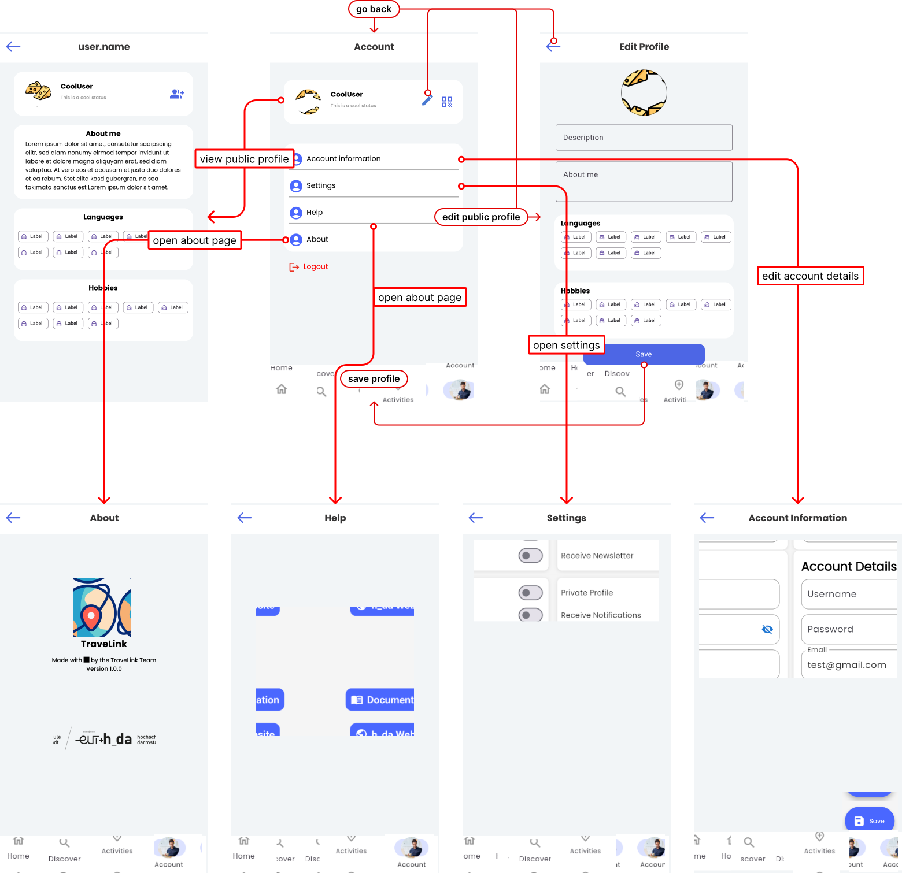
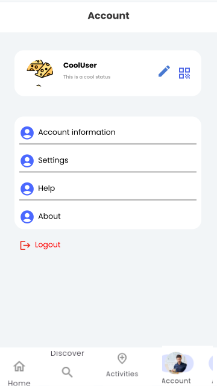
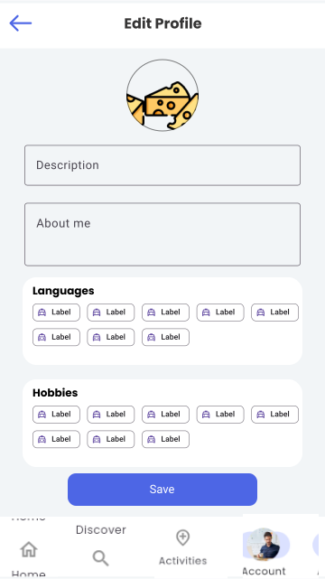
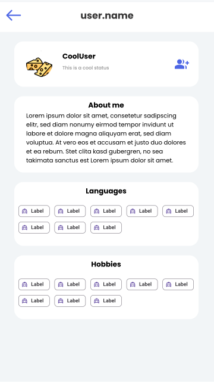
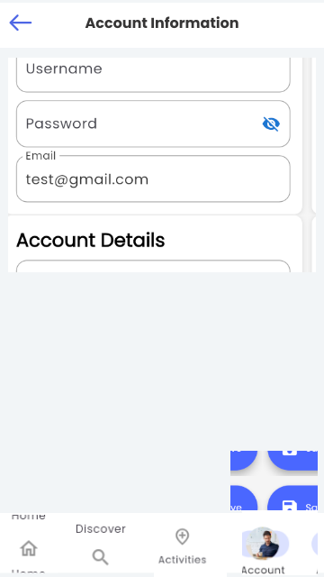
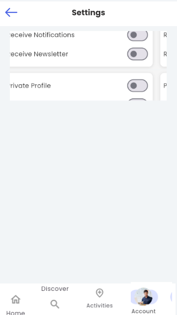
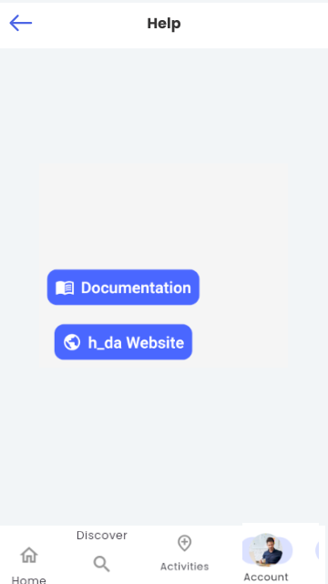
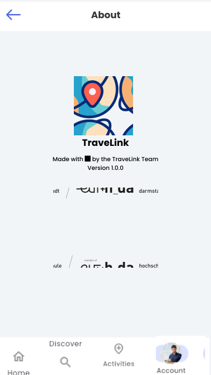
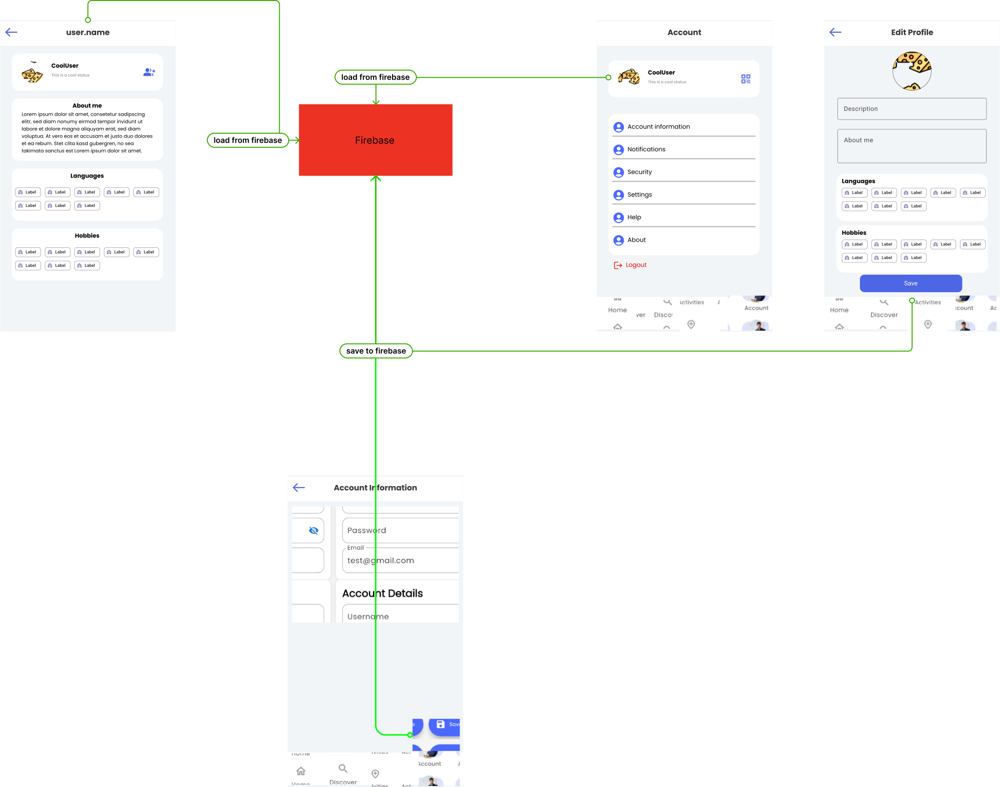

### User profiles

This section presents and describes the screens related to user profiling and interaction in detail. Here, you can find the user flow diagram and data flow diagram.

### User Flow Diagram

## Main Screen
!!! info "Explanation"
    The main account screen serves as the central hub for users to access and manage their account information. It provides a user-friendly interface that allows users to view and update their profile details, such as name, email, and profile picture. Additionally, users can navigate to different sections of the application, such as settings, preferences, and help options. The main account screen is designed to enhance user experience and provide easy access to all account-related functionalities.

<figure markdown="span">
{: width="250em"}
</figure>

## Edit Public Profile Screen
!!! info "Explanation"
    The edit public profile screen allows users to customize and manage their public profile information. Users can update their name, description, add a profile picture, and provide additional details such as their location, interests, and languages. This screen provides a user-friendly interface that empowers users to showcase their personality and connect with others in the community. Users can easily modify their public profile to reflect their evolving interests and preferences.

<figure markdown="span">

</figure>
    
## Public Profile Screen
!!! info "Explanation"
    The public profile screen displays the information that users have chosen to make public on their profile. It provides a user-friendly interface that allows other users to view and learn more about a user's interests, location, and other details. This screen promotes community engagement and facilitates connections between users with shared interests. Users can easily navigate to this screen to get a glimpse into someone's profile and initiate interactions based on common interests or goals.

<figure markdown="span">

</figure>

## Account Screen Sections

### Account Information
!!! info "Explanation"
    The Account Information section allows users to view and manage their personal account details. Users can access and update information such as their username, email address, and password. This section provides a user-friendly interface that ensures users have control over their account information and can keep it up to date.

<figure markdown="span">

</figure>

### Settings
!!! info "Explanation"
    The Settings section provides users with the ability to customize their application preferences and adjust various settings according to their needs. This section ensures that users have a personalized experience and can tailor the application to suit their preferences.

<figure markdown="span">

</figure>

### Help
!!! info "Explanation"
    The Help section offers users access to resources and support to assist them in using the application effectively. Users can find a link for the documentation here. This section aims to provide users with the necessary assistance and guidance to resolve any issues they may encounter while using the application.

<figure markdown="span">

</figure>

### About
!!! info "Explanation"
    The About section provides users with information about the application itself. Users can find details about the application's purpose, version and development team. This section aims to provide transparency and give users a better understanding of the application they are using.

<figure markdown="span">

</figure>

## Data Flow Diagram

Here you can see the data flow diagram, which shows how data flows through the application.

When you click on your profile card on the main screen, you will be redirected to your public profile. This data is being loaded from firebase.

By clicking the edit icon, you will be redirected to the edit profile page. From there you can update your profile and store the changes back to firebase.
A similar mechanic is provided by the Account Information screen. Here you can interact with Firebase Auth to update your Account Credentials like e-mail and password.

Every data on the screen will be updated after the mentioned mechanics to provide a smooth experience.

