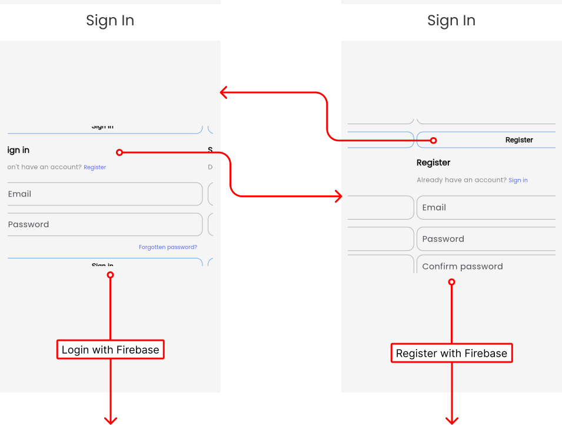

## Login
!!! info "Explanation"
	Create a new account to join our community and enjoy exclusive features like planning your own trips or joining trips. Only `email` and `password` supported so far. For this demo `email`can be invalid. Login to `mail@gmail.com` as email and `Test123` as password for a fed account. For implementation [firebase ui auth](https://pub.dev/packages/firebase_auth) is used!

<figure markdown="span">
  {: width="500em"}
</figure>

## Discover Public Trips
!!! info "Explanation"
	The user can explore public trips in this section. He is able to explore trips in an interactive way by swipping the trips. He can also filter the trips displayed by country and date range. Finally he can also select if he only wants to see archived trips. Click on a trip to navigate to the [details page](plan-trips.md#trip-overview)

<figure markdown="span">
  
</figure>

## My Trips
!!! info "Explanation"
	In the MyTrips-section the trips the user is involved are displayed. Click on a trip to navigate to the [details page](plan-trips.md#trip-overview). The user can create new trips with name, description, destination, date range and privacy setting. He can search for the destination interactively.

<figure markdown="span">
  
</figure>