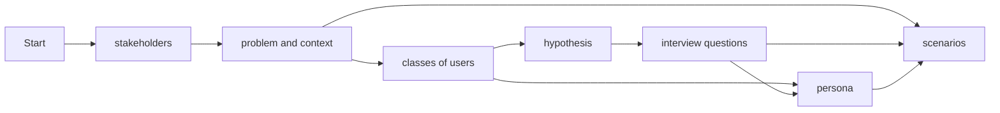

ONLY FOR TESTING McDocs! WILL BE REMOVED LATER ON!

!!! info inline end "Lorem ipsum"

    Lorem ipsum dolor sit amet, consectetur
    adipiscing elit. Nulla et euismod nulla.
    Curabitur feugiat, tortor non consequat
    finibus, justo purus auctor massa, nec
    semper lorem quam in massa.


!!! note annotate "Phasellus posuere in sem ut cursus (1)"

    Lorem ipsum dolor sit amet, (2) consectetur adipiscing elit. Nulla et
    euismod nulla. Curabitur feugiat, tortor non consequat finibus, justo
    purus auctor massa, nec semper lorem quam in massa.

1.  :man_raising_hand: I'm an annotation!
2.  :woman_raising_hand: I'm an annotation as well!


!!! example

    === "Unordered List"

        ``` markdown
        * Sed sagittis eleifend rutrum
        * Donec vitae suscipit est
        * Nulla tempor lobortis orci
        ```

    === "Ordered List"

        ``` markdown
        1. Sed sagittis eleifend rutrum
        2. Donec vitae suscipit est
        3. Nulla tempor lobortis orci
        ```


<div class="grid cards" markdown>

-   :material-clock-fast:{ .lg .middle } __Set up in 5 minutes__

    ---

    Install [`mkdocs-material`](#) with [`pip`](#) and get up
    and running in minutes

    [:octicons-arrow-right-24: Getting started](#)

-   :fontawesome-brands-markdown:{ .lg .middle } __It's just Markdown__

    ---

    Focus on your content and generate a responsive and searchable static site

    [:octicons-arrow-right-24: Reference](#)

-   :material-format-font:{ .lg .middle } __Made to measure__

    ---

    Change the colors, fonts, language, icons, logo and more with a few lines

    [:octicons-arrow-right-24: Customization](#)

-   :material-scale-balance:{ .lg .middle } __Open Source, MIT__

    ---

    Material for MkDocs is licensed under MIT and available on [GitHub]

    [:octicons-arrow-right-24: License](#)

</div>

- [x] Lorem ipsum dolor sit amet, consectetur adipiscing elit
- [ ] Vestibulum convallis sit amet nisi a tincidunt
    * [x] In hac habitasse platea dictumst
    * [x] In scelerisque nibh non dolor mollis congue sed et metus
    * [ ] Praesent sed risus massa
- [ ] Aenean pretium efficitur erat, donec pharetra, ligula non scelerisque

<figure markdown="span">
  { width="300" }
  <figcaption>Image caption</figcaption>
</figure>

{ align=right }


Lorem ipsum[^1] dolor sit amet, consectetur adipiscing elit.[^2]

[^1]: Lorem ipsum dolor sit amet, consectetur adipiscing elit.
[^2]: Lorem ipsum dolor sit amet, consectetur adipiscing elit.


Document your user research (plan and findings).

## Mkdocs snippets
- unordered list with - and four spaces for sub list
- ordered list with 1.
- links with [mkdocs-material](https://squidfunk.github.io/mkdocs-material/reference/)
- references defined in docs/lit.bib may be referenced with [@hciscript]
- reference a chapter of your docs [demo](./3-Design.md#demo)
- code snippets

```dart
Future<void> printOrderMessage() async {
  print('Awaiting user order...');
  var order = await fetchUserOrder();
  print('Your order is: $order');
}
```


{: height="5em" width="5em"}


	
<figure markdown="span">
  {width=200}
  <figcaption>
    <a href="https://www.nngroup.com/articles/ux-research-cheat-sheet/">UX Research Cheat Sheet</a>: UX Methods
  </figcaption>
</figure>

- admonitions

!!! note
	this is a note
	
!!! abstract "title"
	this is an admonition with title
	
!!! info ""
	an info without title
	
!!! tip
	a tip

!!! example
	an example


!!! warning
	a warning
	
!!! cite
	"this is a cite"[@hciscript]

- [mermaid graphics](https://mermaid.js.org/intro/)



- [emojis](https://squidfunk.github.io/mkdocs-material/reference/icons-emojis/)
	- :smile:
	- :video_camera:
	- :fontawesome-solid-user:

  Lorem ipsum dolor sit amet, (1) consectetur adipiscing elit.
{ .annotate }

1.  :man_raising_hand: I'm an annotation! I can contain `code`, __formatted
    text__, images, ... basically anything that can be expressed in Markdown.

> The analysis shows test here test