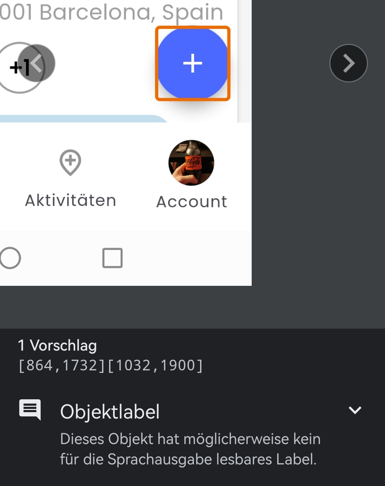
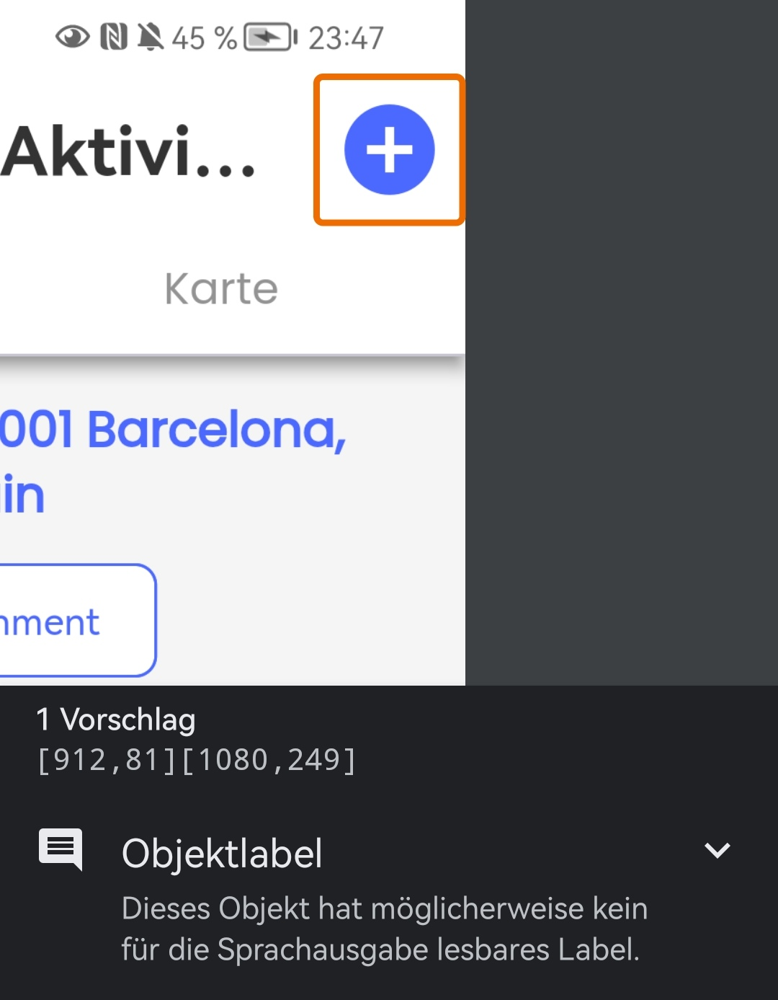
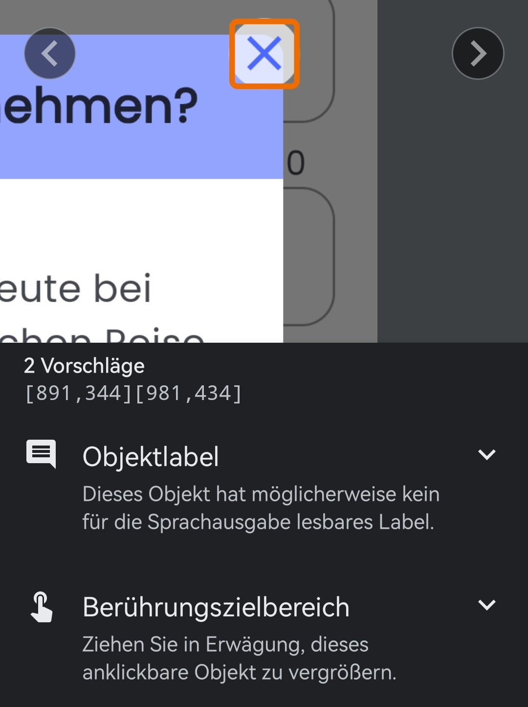
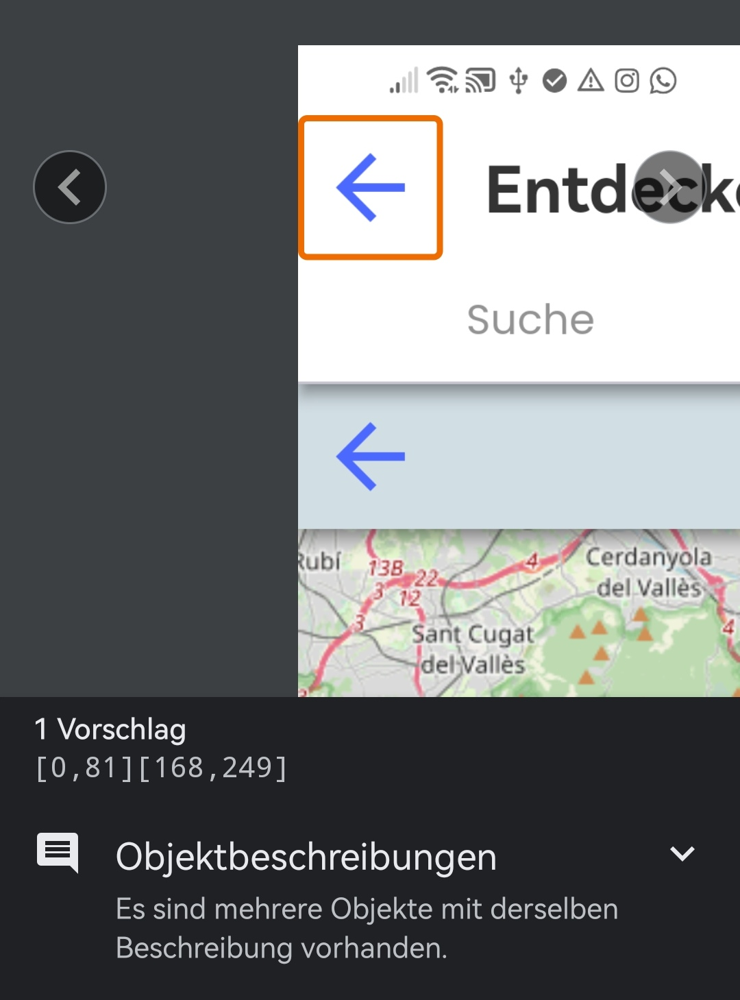
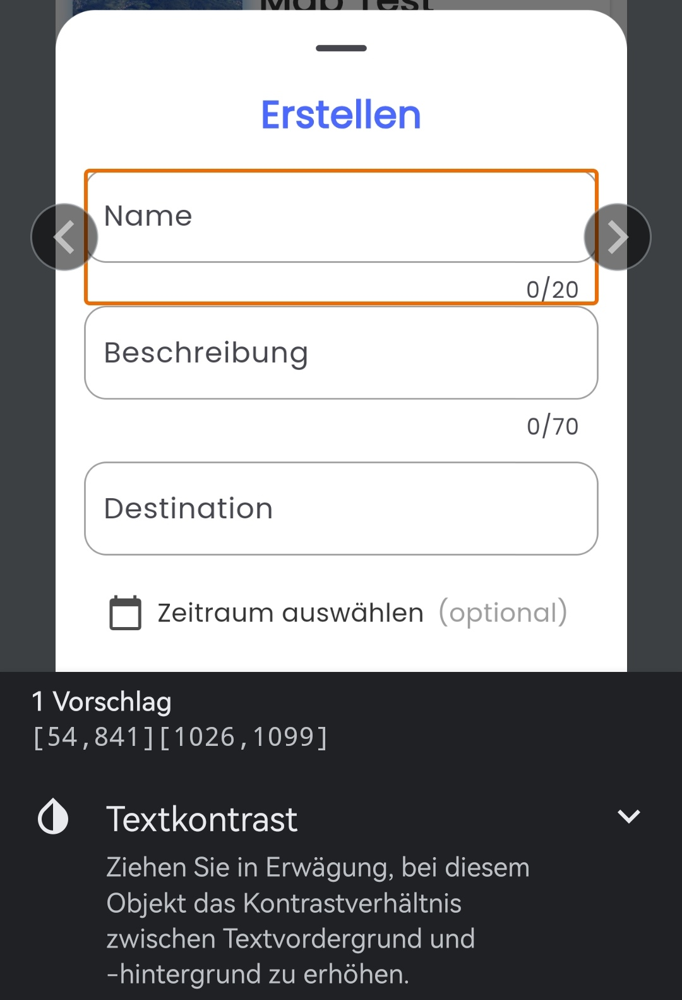

This documents the findings of the accessibility scanner of our app.

## Object-label for voice output

In many cases, the accessibility  scanner found, that we should use computer readable labels for voice output. But often text instead of an icon or plus sign takes more space. We figured out, the best option would be to define an alternative text, which will be used only for voice output.

{: width="300em"}
{: width="300em"}

## Small touch area size

In some cases, the touch area size of a button was marked to small. To fix this, we'll increase the size of the buttons.

{: width="400em"}

## Duplicate icon button

In this case, we used a duplicate app Bar with two back buttons. One back button just closes the map, the other one returns from the activity search.
We agreed that this is unclear and potentially misleading. The user should use the tab bar to switch from map to list view instead.

{: width="400em"}

## Text contrast

In some form fields, we used a grey label. The accessibility scanner marked that the contrast to the background is to little. We may switch to a darker grey in this case.

{: width="400em"}