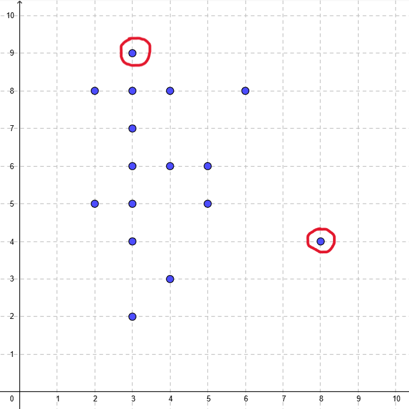

[Based on Prof. Dr. Stefan Zander](https://www.youtube.com/watch?v=qA0DlfghMAY&t=1s)
## 1. User list
- Jakob
- Julian
- Morten
- Mats
- (See the table below for more)

## 2. Criteria list
- Age 
- Gender
- Wealth
- Adventurousness
- Free time
- Languages
- Travel experience
- Planning experience
- Smartphone/pc experience
- Education

### 2.1 Operationalization
We have decided to quantify the criteria on a scale from 0 to 10 so that it is easier to compare the values later on
- e.g. Age: ~20=3 ~40=5 ~80=10
- e.g. languages: native language + basic second language = 3. 3 languages = 6. 5+ languages = 10
- etc. 

## 3. Create Matrix 
|             | Age | Wealth | Adven\-turous\-ness | Free time|Languages|Travel experience|Planning experience|Technical experience| Education|
|-------------|--|--|--|--|--|--|--|--|--|
| Max         | 2| 6| 5| 4| 5| 5| 7| 3| 1|
| Julian      | 5| 4| 6| 7| 5| 3| 6| 6| 6|
| Mats        | 6| 4| 8| 1| 5| 1| 3| 3| 6|
| Morten      | 3| 5| 2| 4| 5| 6| 3| 3| 2|
| Jakob       | 2| 7| 8| 7| 5| 3| 3| 6| 3|
| Frederik    | 4| 2| 3| 2| 6| 5| 6| 8| 6|
| Anonym      | 5| 5| 6| 9| 8| 5| 6| 6| 6|
| Anonym      | 5| 8| 5| 6| 5| 7| 8| 4| 3|
| **Samuel**      | **8**| 4| 4| 3| 6| 6| 3| 4| 7|
| Anonym      | 4| 4| 8| 3| 5| 3| 8| 8| 6|
| Maike       | 3| 3| 5| 7| 6| 3| 4| 6| 4|
| Anonym      | 3| 7| 4| 4| 6| 7| 3|10| 7|
| Jessika     | 4| 4| 6| 6| 5| 6| 6| 7| 4|
| Anonym      | 3| 5| 8| 6| 5| 4| 6| 4| 7|
| Janine      | 3| 7| 5| 4| 3| 5| 2| 9| 7|
| Tim         | 3| 6| 5| 2| 6| 5| 8| 5| 6|
| Erik        | 3| 6| 7| 4| 3| 5| 5| 5| 5|
| **Sebastian**   | 3| 5| **9**| 4| 5| 7| 5| 7| 7|
| Anonym      | 3| 4| 6| 5| 6| 7| 2| 6| 7|
| Anonym      | 3| 7| 6| 2| 5| 5| 8| 4| 7|
| Melanie     | 3| 6| 7| 4| 5| 8|10| 8| 4|

## 4. N-Dimentional Vector Space
For a two dimentional vector space we choose the criterias: **age**, **adventurousness**

The X-Axis shows the Age 

The Y-Axis shows the adventurousness
## 4.1 Persona
Go to [Persona](personas.md)