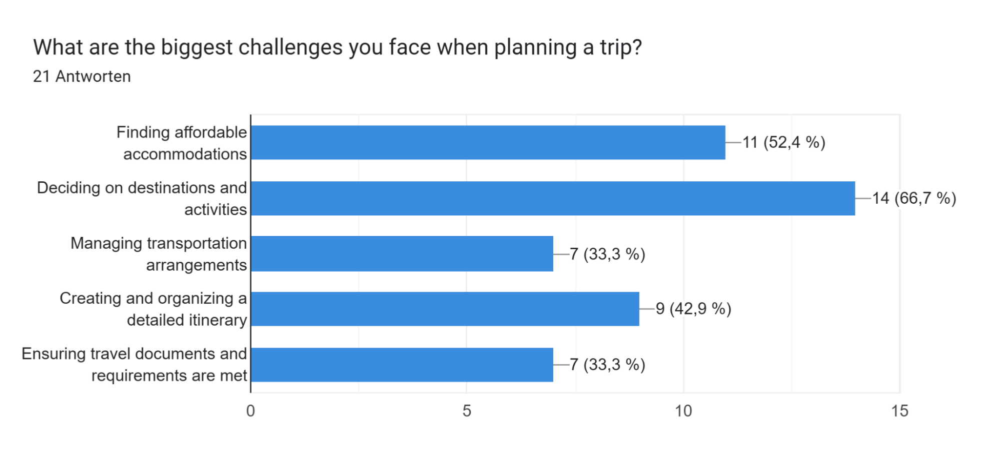

# Survey Evaluation
## Participant Analysis
#### Genders

#### Age

#### Wealth

#### Adventurousness

#### Free Time

#### Languages

#### Travel Experience

#### Planning Experience

#### Technical Experience

#### Highest Level of Education

## Travel Analysis
### Habits Analysis
#### Travel Frequency

#### Budget Influence

#### Company Preference

#### Travel Companions Amount

#### Trips Length

## Travel Planning Analysis
#### Spontaneousness

#### Planning Role

#### Biggest Challenges

#### Used Planning Apps

#### Used Activity Finding Apps

#### Problems while using common apps
Users reported several annoyances with the apps. Some found the layout unclear and overwhelming due to excessive and unnecessary information. Others were frustrated by the excessive number of filters and the occasional absence of links for contact details. However, one user mentioned having no complaints. Overall, the main issues are cluttered interfaces, too many filters, and missing contact information links.

#### Problems while planning a trip
When planning a trip with friends, users identified several main annoyances. Changes in schedules or plans that require starting over, differing views and interests regarding the trip, and the challenge of selecting destinations are common frustrations. Coordinating and ensuring everyone is on the same page also poses difficulties. Budget concerns, synchronizing vacation times, and the overall hassle of planning were highlighted as well. Additionally, some wished for better weather forecasting tools to aid in planning.

## Social Networking Analysis
### Travelling with new people through app
#### Finding New Travel Companions

#### Companion Information

#### Companion Origin / Who Would You Travel With

#### Main expectations planned before trip
Key expectations and rules before traveling with companions include clarifying personal habits such as alcohol consumption, smoking, or other behaviors to prevent discomfort. It's crucial to agree on adhering to pre-trip agreements, discussing past travel experiences and preferences, and establishing clear guidelines for budgeting and cost-sharing to ensure a smooth and enjoyable trip for everyone involved.

#### Reasons for Travel App

## Feature Analysis
### Average Feature Interest

#### Ratings ordered by results

| Feature                          | Rating |
|----------------------------------|--------|
| Organizing Expenses              | 4.06   |
| Discover Activities              | 3.76   |
| Chat                             | 3.74   |
| Shared Checklists                | 3.62   |
| Shared Gallery                   | 3.52   |
| Weather for travel period        | 3.52   |
| Activity assignment to days      | 3.52   |
| Integrated Map                   | 3.33   |
| Archiving past trips             | 3.33   |
| Transportation Details           | 3.05   |
| Store Travel documents           | 2.95   |
| Polls                            | 2.81   |

## Follow-Up
#### User suggestions
- Implementing a swipe gesture similar to Lovoo or Tinder to sort "holiday destinations" or "travel destinations" as interesting or not interesting.
- Adding a weather app feature.
- Including information on whether activities are suitable for people with disabilities or are accessible.
- Integrating reviews from other travelers to provide insights and recommendations.
#### Likeliness for Travel App
