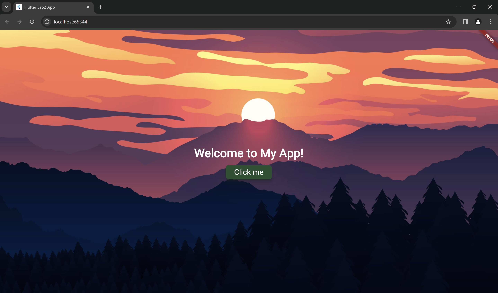
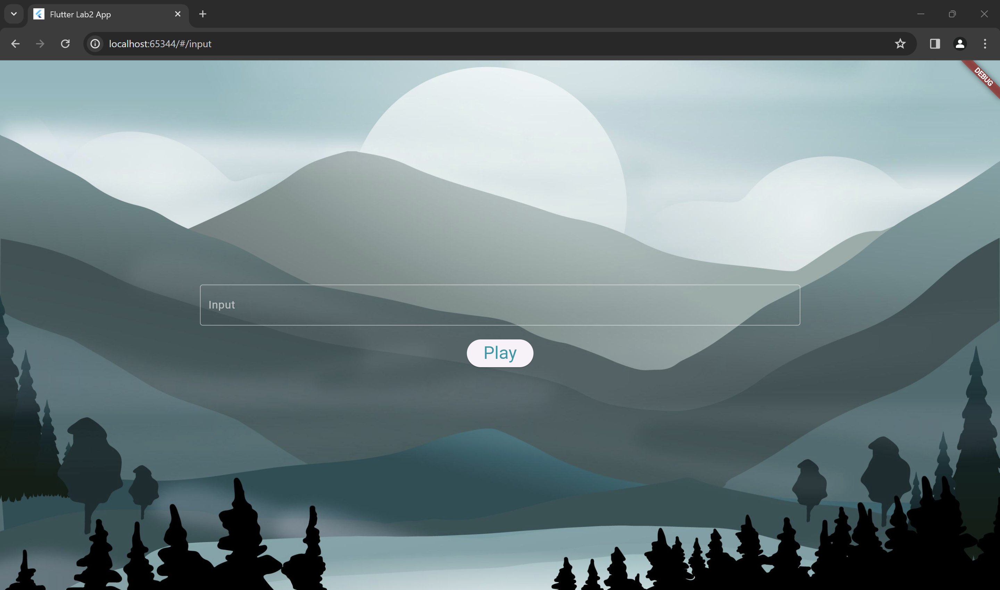
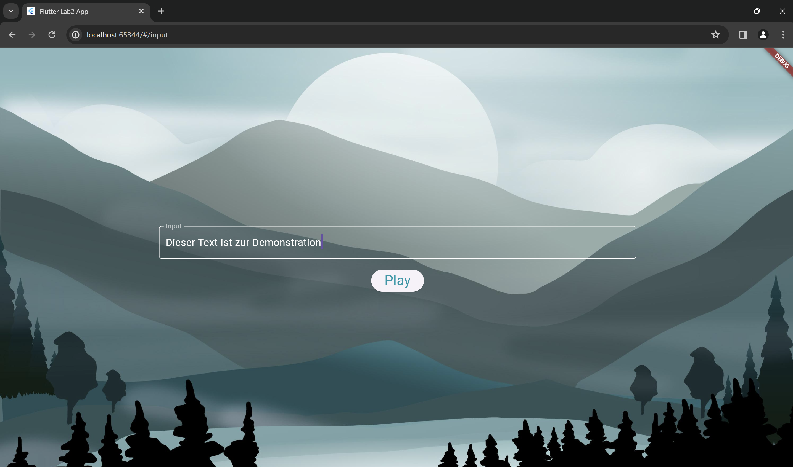
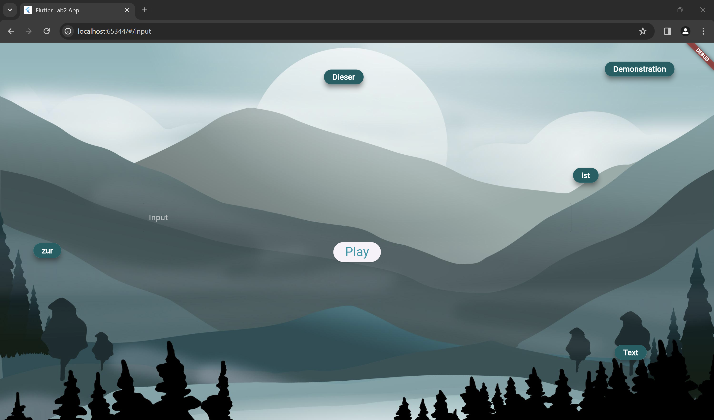
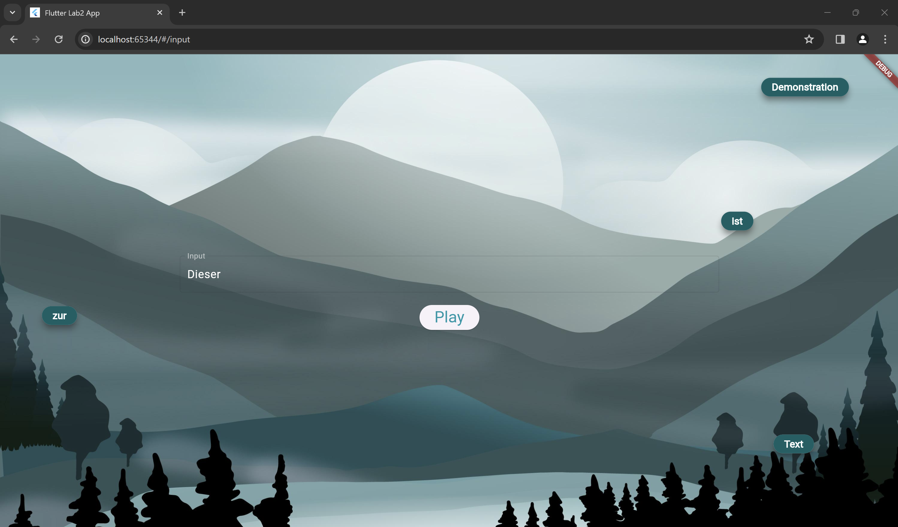
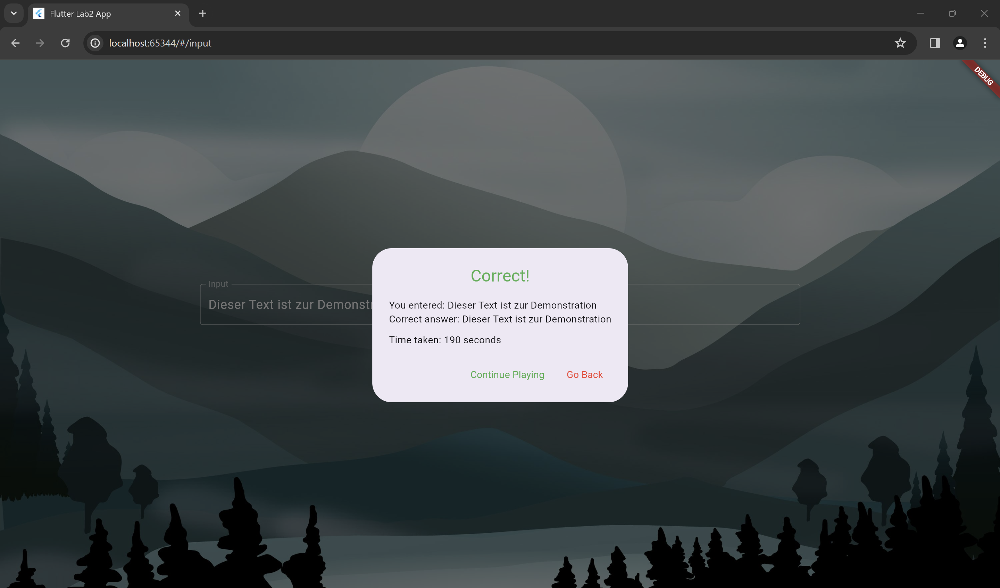

## Lab2 Vorbereitung

Die Anwendung wurde gemäß diesen Vorgaben aufgebaut

### Greetings Screen

### Game Screens

Gebe Text in das Feld ein und drücke Play, um das Spiel zu starten.

Klicke nun die Wörter in der richtigen Reihenfolge nacheinander an.

Wenn ein Wort angeklickt wurde, erscheint es wieder in dem Text-Feld.

Wenn der Satz wieder vollständig zusammengesetzt wurde, erscheint eine Benachrichtigung.

